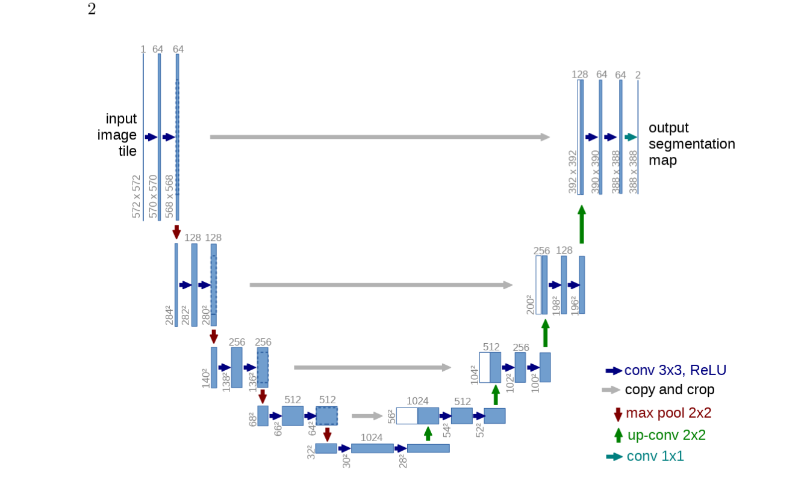

# Baseline 1 — U-Net Adversarial Domain Adaptation
<p align="center">
  
</p>
## Overview

This baseline investigates **synthetic-to-real domain adaptation for semantic segmentation** using a U-Net as the segmentation generator.

The model is trained on two domains:

* **GTA5 (GTA5 Segmentation Dataset)** — Synthetic source domain with pixel-level segmentation annotations.
* **Cityscapes (Cityscapes Dataset)** — Real-world target domain.

The GTA5 dataset used in this experiment is the publicly available **GTA5 Segmentation dataset from Kaggle**:
https://www.kaggle.com/datasets/gurazeez/gta5-segmentation

The Cityscapes dataset used in this experiment is the publicly available dataset from Kaggle:
https://www.kaggle.com/datasets/shuvoalok/cityscapes

The main idea is to train the U-Net with two objectives:

1. Learn accurate semantic segmentation using labeled synthetic data (GTA5).
2. Learn domain-invariant segmentation representations through adversarial training against real-world data (Cityscapes).

A CNN-based discriminator is introduced to distinguish between segmentation maps generated from the two domains.

---

## Problem Definition

Semantic segmentation models trained on synthetic datasets often suffer from a significant **domain gap** when applied to real-world images.

Although the GTA5 Segmentation dataset provides large-scale automatically generated pixel-level annotations, its visual and semantic distribution differs from real-world datasets such as Cityscapes.

The goal of this baseline is therefore:

> Train a segmentation model using labeled synthetic data (GTA5) while adapting its predictions toward the real target domain (Cityscapes).

The adaptation can be summarized as:

```text
Synthetic Domain (GTA5)                 Real Domain (Cityscapes)
        │                                       │
        ▼                                       ▼
   Input Image                             Input Image
        │                                       │
        └──────────────┐       ┌────────────────┘
                       ▼       ▼
                     ┌──────────┐
                     │  U-Net   │
                     │Generator │
                     └────┬─────┘
                          │
                          ▼
                  Segmentation Maps
                          │
                          ▼
                 ┌─────────────────┐
                 │ Discriminator D │
                 │      CNN        │
                 └────────┬────────┘
                          │
                          ▼
                     Domain Label
```

---

## Architecture

### Generator — U-Net

The U-Net is used as the segmentation generator.

```text
Input Image
     │
     ▼
┌─────────────┐
│   Encoder   │
└──────┬──────┘
       │
       ▼
   Bottleneck
       │
       ▼
┌─────────────┐
│   Decoder   │
└──────┬──────┘
       │
       ▼
Segmentation Map
```

The encoder extracts hierarchical visual features, while the decoder progressively reconstructs spatial information.

Skip connections transfer high-resolution features from the encoder to the decoder, allowing the network to preserve object boundaries and fine-grained spatial information.

For an image of spatial size `H × W` and `C` semantic classes, the generator produces:

```text
G(x) → [C, H, W]
```

where each pixel contains a probability distribution over semantic classes.

---

## Discriminator

A CNN-based discriminator is used as the adversarial component.

Its input is the **segmentation map produced by the generator**, rather than the original RGB image.

```text
Segmentation Map
       │
       ▼
┌──────────────┐
│ CNN          │
│ Discriminator│
└──────┬───────┘
       │
       ▼
   Domain Prediction
```

The discriminator learns to distinguish between segmentation predictions originating from:

* GTA5 (synthetic source domain)
* Cityscapes (real target domain)

Conceptually:

```text
GTA5 → U-Net → Source Segmentation → Discriminator → Source

Cityscapes → U-Net → Target Segmentation → Discriminator → Target
```

The discriminator therefore learns the difference between the segmentation-map distributions of synthetic and real domains.

---

## Training Objective

The training process combines **supervised segmentation learning** with **adversarial domain adaptation**.

### 1. Segmentation Loss (Supervised on GTA5)

Since the GTA5 Segmentation dataset provides ground-truth masks, the generator is trained using supervised learning.

For a source image `x_s` and its ground-truth mask `y_s`:

```text
x_s → U-Net → ŷ_s
```

The segmentation loss is:

```text
L_seg = CE(G(x_s), y_s)
```

where `CE` is pixel-wise cross-entropy loss.

This ensures that the model learns correct semantic segmentation on the synthetic domain.

---

### 2. Adversarial Loss

The discriminator receives segmentation predictions and learns to distinguish their domain.

The generator is trained to fool the discriminator, encouraging **domain-invariant segmentation outputs**.

The overall generator objective is:

```text
L_G = L_seg + λ_adv L_adv
```

where:

* `L_seg` — supervised segmentation loss on GTA5
* `L_adv` — adversarial loss for domain alignment
* `λ_adv` — weighting factor for adversarial contribution

---

## Training Pipeline

### Source Domain (GTA5)

```text
GTA5 Image
    │
    ▼
   U-Net
    │
    ▼
Source Segmentation Prediction
    │
    ├──────────────► Segmentation Loss
    │                      ▲
    │                      │
    │              Ground Truth (GTA5)
    │
    ▼
Discriminator
    │
    ▼
Domain Prediction
```

### Target Domain (Cityscapes)

```text
Cityscapes Image
      │
      ▼
     U-Net
      │
      ▼
Target Segmentation Prediction
      │
      ▼
Discriminator
      │
      ▼
Domain Prediction
```

Cityscapes images are used without labels during training and only contribute to adversarial alignment.

---

## Why Use Segmentation Maps for the Discriminator?

Instead of operating on RGB images, the discriminator operates on segmentation outputs.

This shifts the adversarial objective from appearance-level alignment to **semantic-level alignment**.

The goal is not:

```text
Synthetic image ≠ Real image
```

but rather:

```text
Synthetic segmentation distribution
        ↓
align with
        ↓
Real segmentation distribution
```

This encourages the generator to produce predictions that are structurally consistent across domains.

---

## Datasets

### GTA5 Segmentation Dataset (Kaggle)

* Source: https://www.kaggle.com/datasets/gurazeez/gta5-segmentation
* Synthetic urban driving scenes
* Provides:

  * RGB images
  * Pixel-level semantic segmentation masks
* Used for supervised training of the segmentation model

### Cityscapes Dataset (Kaggle)

* Source: https://www.kaggle.com/datasets/shuvoalok/cityscapes
* Real-world urban street scenes
* Used as target domain for adversarial adaptation
* Labels are not used during training (only for evaluation)

---

## Baseline Goal

This baseline establishes a strong CNN-based reference model using U-Net.

The experiment evaluates whether adversarial learning improves transfer from:

```text
GTA5 (Synthetic Domain)
        ↓
   Domain Adaptation
        ↓
Cityscapes (Real Domain)
```

---

## Evaluation

The primary evaluation is performed on the Cityscapes target domain.

Recommended metrics:

* **Mean Intersection over Union (mIoU)** (primary metric)
* Pixel Accuracy
* Per-class IoU
* Mean Pixel Accuracy

The most important comparison metric across all baselines is:

> **mIoU on Cityscapes**

---

## Expected Comparison

This baseline serves as the reference point for the following architectures:

```text
Baseline 1 — U-Net
   ↓
Adversarial Adaptation
   ↓
Cityscapes mIoU


Baseline 2 — DeepLabV3+
   ↓
Adversarial Adaptation
   ↓
Cityscapes mIoU


Baseline 3 — Transformer-based Segmentation
   ↓
Adversarial Adaptation
   ↓
Cityscapes mIoU
```

All baselines share the same:

* Discriminator design
* Training strategy
* Datasets (GTA5 + Cityscapes)
* Evaluation protocol

This ensures a fair comparison of how the **segmentation architecture choice** affects synthetic-to-real domain adaptation performance.
