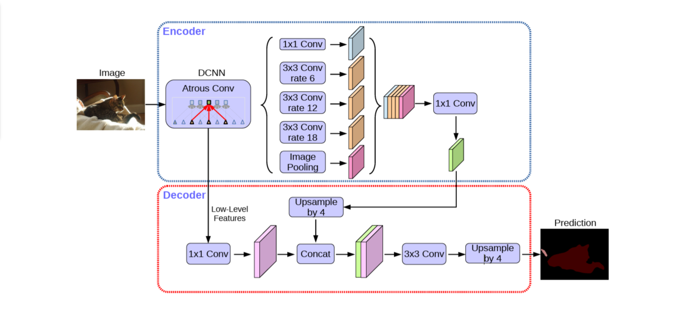

# Baseline 2 — DeepLabV3+ for Synthetic-to-Real Semantic Segmentation

  

## Overview

This repository presents the **second baseline** of a Synthetic-to-Real Semantic Segmentation project. The objective is to investigate whether a stronger segmentation architecture can improve the transfer of semantic segmentation knowledge from a synthetic environment to real-world urban scenes.

In this baseline, **DeepLabV3+** replaces the U-Net architecture used in Baseline 1 while maintaining the same general adversarial domain adaptation framework.

The model is trained using:

* **GTA5** as the synthetic source domain.
* **Cityscapes** as the real target domain.
* **DeepLabV3+** as the segmentation network.
* A **CNN-based discriminator** for adversarial domain adaptation.
* **Cross-Entropy Loss** for supervised semantic segmentation.
* **Binary Cross-Entropy with Logits Loss** for adversarial training.

The main purpose of this baseline is to evaluate whether the multi-scale feature extraction and encoder-decoder design of DeepLabV3+ can provide better synthetic-to-real segmentation performance than the U-Net baseline.

---

## Problem Statement

Semantic segmentation models typically require large amounts of pixel-level annotated data. However, obtaining dense pixel-level annotations for real-world images is expensive and time-consuming.

Synthetic datasets provide an attractive alternative because they can be generated with accurate pixel-level annotations automatically. Nevertheless, models trained on synthetic images often experience a significant **domain gap** when applied to real-world images.

The domain gap can arise from differences in:

* Appearance
* Lighting
* Textures
* Colors
* Object characteristics
* Camera properties
* Environmental conditions
* Image statistics

Consequently, a segmentation model trained only on GTA5 may not generalize effectively to Cityscapes.

This project investigates **adversarial domain adaptation** as a way to reduce this gap.

---

## Objective

The primary objective of Baseline 2 is:

> **To evaluate the effectiveness of DeepLabV3+ for synthetic-to-real semantic segmentation under adversarial domain adaptation.**

More specifically, the experiment investigates whether DeepLabV3+'s ability to capture multi-scale contextual information improves segmentation performance on the target domain compared with the U-Net-based baseline.

---

# Dataset

## GTA5 — Source Domain

GTA5 is used as the **synthetic source domain**.

The dataset provides synthetic urban scenes together with pixel-level semantic annotations. These annotations provide the supervised signal required to train the segmentation network.

The source-domain training process therefore uses:

* Synthetic RGB images
* Ground-truth semantic segmentation masks

GTA5 provides the main supervised segmentation objective during training.

---

## Cityscapes — Target Domain

Cityscapes is used as the **real-world target domain**.

It contains street-scene images captured in real urban environments and provides a realistic visual distribution that differs significantly from GTA5.

In the adversarial framework, Cityscapes represents the target domain whose segmentation-map distribution the model is encouraged to reproduce.

---

# Baseline 2 Architecture

The overall architecture consists of two major components:

### Segmentation Network

**DeepLabV3+** acts as the main segmentation network.

Its responsibility is to transform an input image into a dense semantic segmentation prediction.

### Domain Discriminator

A CNN-based discriminator receives segmentation maps and attempts to distinguish between predictions originating from the source and target domains.

The two networks therefore have complementary objectives:

* **DeepLabV3+** learns to produce accurate and domain-invariant segmentation maps.
* **The discriminator** learns to distinguish the domain characteristics of the predicted segmentation maps.

---

# DeepLabV3+

DeepLabV3+ is an encoder-decoder architecture designed specifically for semantic segmentation.

It combines:

* A powerful convolutional backbone
* Atrous convolution
* Atrous Spatial Pyramid Pooling (ASPP)
* Low-level feature extraction
* Decoder-based spatial refinement

This combination enables the model to capture both high-level semantic information and fine spatial details.

---

## Encoder

The encoder extracts hierarchical visual features from the input image.

A pretrained convolutional backbone can be used to provide strong feature representations.

During encoding, the spatial resolution of the feature maps is progressively reduced while their semantic richness increases.

The resulting high-level features contain strong contextual information about the objects and regions present in the scene.

However, excessive downsampling can result in the loss of fine spatial details.

DeepLabV3+ addresses this issue through its decoder and low-level feature pathway.

---

# Atrous Convolution

A key component of DeepLabV3+ is **atrous convolution**, also known as dilated convolution.

Atrous convolution expands the receptive field of a convolution without requiring a proportional increase in the number of parameters or reducing the feature-map resolution.

This allows the network to capture contextual information from a larger spatial area.

For semantic segmentation, this is particularly useful because objects can appear at significantly different scales.

For example:

* A nearby vehicle may occupy a large region.
* A distant pedestrian may occupy only a small region.
* Large buildings may span a substantial portion of the image.
* Road signs may contain only a few pixels.

Atrous convolution enables the network to reason about these different spatial scales more effectively.

---

# Atrous Spatial Pyramid Pooling

The **Atrous Spatial Pyramid Pooling (ASPP)** module is one of the defining components of DeepLabV3+.

ASPP applies multiple parallel operations with different dilation rates to the high-level feature representation.

This allows the network to capture information at multiple receptive-field sizes.

Conceptually:

**High-Level Features → Multi-Scale Feature Extraction → Feature Fusion**

The resulting representation contains both local and broader contextual information.

This multi-scale representation is particularly beneficial for complex street scenes containing objects with significantly different sizes.

---

# Decoder

The decoder is responsible for recovering spatial details that may have been lost during the encoding process.

High-level features contain strong semantic information but have relatively low spatial resolution.

DeepLabV3+ combines these high-level representations with low-level features extracted from earlier stages of the encoder.

The low-level features provide detailed spatial information, including:

* Object boundaries
* Fine structures
* Small objects
* Local spatial patterns

The decoder combines these complementary representations and progressively reconstructs a high-resolution segmentation map.

---

# Feature Fusion

The feature-fusion mechanism is an important advantage of DeepLabV3+.

The architecture combines:

**High-Level Features**

with

**Low-Level Features**

High-level features provide:

> **What is present in the image?**

Low-level features provide:

> **Where exactly is it located?**

Combining both representations allows DeepLabV3+ to generate segmentation maps with stronger semantic understanding and more precise boundaries.

---

# Domain Discriminator

The second component of the architecture is a CNN-based domain discriminator.

Unlike a conventional image discriminator, the discriminator operates on **segmentation maps**.

Its purpose is to determine whether a segmentation map belongs to the source or target domain.

The conceptual process is:

**Source Image → DeepLabV3+ → Source Segmentation Map → Discriminator**

and:

**Target Image → DeepLabV3+ → Target Segmentation Map → Discriminator**

The discriminator learns to distinguish between these two distributions.

At the same time, DeepLabV3+ is optimized to produce segmentation predictions that become increasingly difficult for the discriminator to distinguish by domain.

This adversarial interaction encourages the segmentation network to learn more domain-invariant representations.

---

# Adversarial Domain Adaptation

The central idea of this baseline is to combine supervised segmentation learning with adversarial learning.

The segmentation network receives direct supervision from the labeled GTA5 data.

At the same time, the discriminator provides an adversarial signal that encourages the segmentation predictions to become more compatible with the target-domain distribution.

The overall training objective can therefore be viewed as two complementary goals:

### Supervised Objective

Produce accurate semantic segmentation predictions on the source domain.

### Adversarial Objective

Reduce the domain discrepancy between source and target segmentation predictions.

Together, these objectives encourage the model to learn segmentation features that are both:

* **Semantically meaningful**
* **More robust across domains**

---

# Loss Functions

## Segmentation Loss

The supervised segmentation objective uses **Cross-Entropy Loss**.

It compares the predicted class distribution at every pixel with the corresponding ground-truth class provided by GTA5.

This loss ensures that the model maintains its ability to perform accurate semantic segmentation instead of focusing exclusively on domain alignment.

---

## Adversarial Loss

The adversarial component uses **Binary Cross-Entropy with Logits Loss**.

The discriminator learns to distinguish between source-domain and target-domain segmentation predictions.

The segmentation network, in contrast, receives an adversarial signal that encourages its predictions to become more difficult to distinguish based on their domain.

---

# Training Strategy

The training process alternates between two objectives.

## Discriminator Optimization

The discriminator is trained to correctly identify the domain of segmentation maps.

Its goal is to improve its ability to distinguish source-domain predictions from target-domain predictions.

During this stage, the segmentation network is not updated through the discriminator's optimization objective.

---

## Segmentation Network Optimization

DeepLabV3+ is then optimized using the combination of:

* Supervised segmentation loss
* Adversarial domain adaptation loss

The segmentation loss preserves semantic accuracy, while the adversarial loss encourages domain alignment.

This alternating optimization forms the adversarial training process.

---

# Why DeepLabV3+?

DeepLabV3+ was selected for Baseline 2 because it provides several advantages over a standard U-Net architecture.

### Multi-Scale Context

ASPP allows the model to capture contextual information at multiple spatial scales.

### Large Receptive Field

Atrous convolution increases the receptive field without requiring aggressive spatial downsampling.

### Strong Semantic Representation

A pretrained backbone can provide rich high-level visual features.

### Accurate Boundaries

The decoder combines high-level semantic information with low-level spatial features.

### Established Segmentation Architecture

DeepLabV3+ is a well-established architecture for semantic segmentation and provides a strong baseline for comparison.

---

# Baseline 1 vs. Baseline 2

| Component                 | Baseline 1        | Baseline 2          |
| ------------------------- | ----------------- | ------------------- |
| Segmentation Architecture | U-Net             | DeepLabV3+          |
| Feature Extraction        | Encoder           | Deep Encoder + ASPP |
| Multi-Scale Context       | Limited           | Strong              |
| Atrous Convolution        | No                | Yes                 |
| ASPP                      | No                | Yes                 |
| Decoder                   | U-Net Decoder     | DeepLabV3+ Decoder  |
| Domain Discriminator      | CNN               | CNN                 |
| Segmentation Loss         | Cross-Entropy     | Cross-Entropy       |
| Adversarial Loss          | BCEWithLogitsLoss | BCEWithLogitsLoss   |
| Source Domain             | GTA5              | GTA5                |
| Target Domain             | Cityscapes        | Cityscapes          |

The main experimental variable between the two baselines is therefore the **segmentation architecture**.

The overall domain adaptation strategy remains consistent, allowing a more meaningful comparison.

---

# Experimental Question

The primary research question for this baseline is:

> **Does DeepLabV3+ provide better synthetic-to-real semantic segmentation performance than U-Net under the same adversarial domain adaptation framework?**

This comparison allows us to determine whether improvements in segmentation architecture translate into better target-domain generalization.

---

# Evaluation

The primary evaluation target is the performance of the model on the **Cityscapes target domain**.

The main evaluation metric is:

## Mean Intersection over Union

**mIoU** is one of the standard metrics for semantic segmentation.

It evaluates the overlap between predicted and ground-truth regions for each semantic class and then averages the resulting IoU scores across classes.

Additional metrics may include:

* Pixel Accuracy
* Mean Pixel Accuracy
* Per-Class IoU
* Dice Score

Visual inspection of predicted segmentation maps is also useful for analyzing:

* Object boundaries
* Small-object segmentation
* Confusion between classes
* Domain-specific failures
* Overall prediction quality

---

# Expected Benefits

Compared with the U-Net baseline, DeepLabV3+ is expected to provide improvements in areas where contextual understanding and multi-scale reasoning are important.

Potential improvements include:

* Better segmentation of objects at different scales
* Improved object boundaries
* Stronger contextual understanding
* Better representation of complex urban scenes
* Improved generalization to the target domain

However, the actual improvement must be determined experimentally through quantitative evaluation.

---

# Computational Considerations

DeepLabV3+ is more computationally demanding than a lightweight U-Net configuration.

Training requirements depend on:

* Input resolution
* Batch size
* Backbone architecture
* Number of segmentation classes
* GPU memory
* Discriminator architecture

For limited GPU resources, reducing the batch size or input resolution can help manage memory consumption.

Mixed-precision training can also be considered to reduce GPU memory usage and improve training efficiency.

---

# Experimental Workflow

The complete experimental workflow can be summarized as:

**1. Source Data**

GTA5 provides labeled synthetic images.

↓

**2. Target Data**

Cityscapes provides real-world target-domain images.

↓

**3. Segmentation**

DeepLabV3+ generates segmentation predictions for both domains.

↓

**4. Supervised Learning**

GTA5 predictions are compared against their ground-truth segmentation masks.

↓

**5. Domain Discrimination**

The discriminator attempts to identify the domain of the predicted segmentation maps.

↓

**6. Adversarial Adaptation**

DeepLabV3+ is optimized to produce predictions that become increasingly domain-invariant.

↓

**7. Target-Domain Evaluation**

The adapted model is evaluated on Cityscapes.

---

# Limitations

Despite its advantages, this baseline has several limitations.

### Computational Cost

DeepLabV3+ can require more computational resources than simpler segmentation architectures.

### Domain Alignment

Adversarial alignment of segmentation maps does not guarantee complete alignment of the underlying image-domain distributions.

### Training Stability

Adversarial optimization can be sensitive to the balance between the segmentation network and discriminator.

### Target-Domain Supervision

The approach relies on domain-level information rather than direct pixel-level supervision for the target domain.

---

# Future Work

This baseline is part of a progressive experimental study.

The planned next step is to investigate a **Vision Transformer-based segmentation architecture** as a third baseline.

The overall progression is:

**Baseline 1**

U-Net + Adversarial Domain Adaptation

↓

**Baseline 2**

DeepLabV3+ + Adversarial Domain Adaptation

↓

**Baseline 3**

Vision Transformer + Adversarial Domain Adaptation

This progression enables a systematic comparison between convolutional encoder-decoder architectures and transformer-based approaches for synthetic-to-real semantic segmentation.

---

# Conclusion

Baseline 2 introduces **DeepLabV3+** into the synthetic-to-real semantic segmentation framework.

By combining:

* DeepLabV3+
* Atrous Convolution
* ASPP
* Encoder-decoder feature fusion
* Supervised segmentation learning
* Adversarial domain adaptation
* GTA5 as the source domain
* Cityscapes as the target domain

the baseline aims to produce a segmentation model that maintains strong semantic accuracy while becoming more robust to the visual differences between synthetic and real-world environments.

The central experimental objective is to determine whether the stronger multi-scale representation of DeepLabV3+ leads to improved target-domain performance compared with the U-Net architecture used in Baseline 1.
